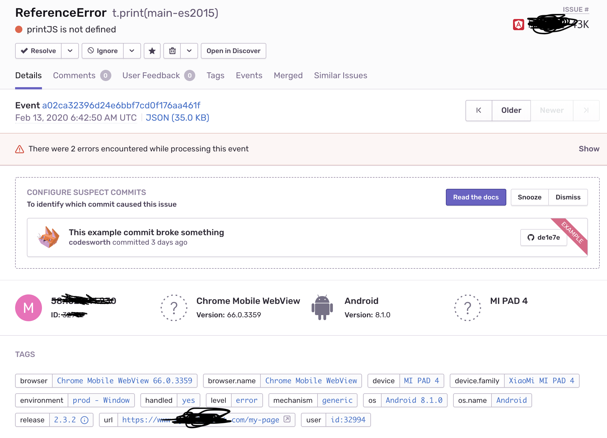

## 상황

Sentry(에러 로깅 서드파티)찍히는 정말 오랫동안 해결하지 못하고 있던 버그를 날 잡고 파 보았다.

***정말 간헐적으로,*** ***우리가 사용하고 있는 라이브러리들이 define 되지 않는 문제였다.***

정말 불규칙 적이고 특수한 케이스에서 이런 버그가 일어나고 있었다. 최신 브라우저 버전에서도, 낮은 브라우저에서도, 브라우저 호환성 때문도 아니고, 나라별 인터넷 속도의 영향도 아니고(글로벌 서비스를 하고 있습니다), 디바이스 문제도 아니였다. 정말 그냥 `Random`하게 일어나고 있었다.

정말 많은 시간을 여기에 할애 했다. 많은 가설을 세워 가며 수 많은 구글링과 github을 뒤지고, 라이브러리를 일일히 까보고, 같은 환경으로 미니프로젝트를 구성하여 빌드되는 결과물을 확인해 보았지만 결국 **근본적인 원인은 찾을 수 없었다.** 비지니스 상황상, 언제까지나 붙잡고 있을 수 는 없었기에 옆으로 돌아가는 방법을 선택했고 해결했다.

Sentry의 `BREADCRUMBS` 기능을 통하여 에러가 나기 전, 유저가 어떤 행동을 했는지 파악할 수 있었다. 애플리케이션을 실행하고 해당 라이브러리를 처음 사용하는 순간, undefined 에러가 난 것이다. 여러 가설이 있었지만, 결국 **라이브러리가 제대로 window객체에 할당되지 않았다고 결론을 내렸다.**

Angular에서는 `angular.json`의 build.options.scripts에 사용할 라이브러리들을 넣고 빌드하면, 빌드한 index.html하단에  `scripts.[hash].js` 을 주입 해준다.

`scripts.[hash].js`에는 angular.json에 등록한 라이브러리들이 순서대로 minify되고 uglify되어 있다.

    // index.html 하단
    
    
    
    
    
    
    

index.html을 보면 알 수 있듯이, `scripts.[hash].js`가 분명히 `main-es-version.[hash].js` 보다 위에 선언되어, 라이브러리들이 window에 주입 되었다. 그럼에도 불구하고, `main-es-version.[hash].js`에서 주입 된 라이브러리들을 읽을 수 없는 예외 케이스가 일어난 것이다.

## 해결하는 방법

    // main.ts
    const bootstrap = async () => {
      await defineLibraries('PC');
      return platformBrowserDynamic().bootstrapModule(PCAppModule);
    };
    
    document.addEventListener('DOMContentLoaded', bootstrap);

`DOMContentLoaded` 이벤트 발생시에, `bootstrap`(앵귤러 최상위 모듈을 실행시키는 것)을 해주고 있었다. bootstrap하는 바로 직전 시점에 window object를 탐색하면서 이전의 `scripts.[hash].js` 에서 주입해주지 못한 라이브러리가 있다면 주입해 주는 방식을 선택했다.

defineLibraries() 함수

*꽤나 더럽다...*😭

    export async function defineLibraries(device: 'PC' | 'MOBILE') {
      if (!window) return;
      return new Promise(async (resolve) => {
    		// 공통으로 사용하는 라이브러리
        if (!window['jQuery']) {
          window['jQuery'] = await import('jquery').then(((m: any) => m.default));
          await import('slick-carousel'); // jQuery임포트 후 slick carousel을 다시 임포트 해야 slick이 깨지지 않는다.
        }
        if (!window['pdfjs-dist/build/pdf']) window['pdfjs-dist/build/pdf'] = await import('ngx-extended-pdf-viewer');
        if (!window['lottie']) window['lottie'] = await import('lottie-web').then((m: any) => m.default);
    
        switch (device) {
          case 'PC':
    				// pc에서만 사용하는 라이브러리
            if (!window['printJS']) window['printJS'] = await import('print-js').then((m: any) => m.default);
            break;
          case 'MOBILE':
    				// mobile에서만 사용하는 라이브러리
            break;
        }
        resolve();
      });
    }

1. 각 라이브러리 마다 window에 할당하는 key이름이 다르다. **사용하는 라이브러리 구현체를 파악해서** window에 어떤 key로 할당 하는지 확인하고 해당 key를 통해 라이브러리를 주입해 주어야 한다.

    jQuery 라이브러리 내부에서는 아래와 같은 방법으로 window 객체에 주입하고 있다.

    `window.jQuery = window.$ = jQuery;` 

1. **Dynamic import**를 사용하여 해당 라이브러리가 window에 정의되어 있지 않은 경우에만 라이브러리를 주입해준다.

    *라이브러리들 key로 배열을 만들고 순회하면서 import되도록 하고 싶었는데 ts에서 지원하지 않는 문법이라 코드가 깔끔하지 못해 아쉽다... ㅠ → switch-case로 되지 않을까..?* 

        // What i want
        ['lib1', 'lib3', 'lib3', 'lib4'].forEach(async(lib) => {
          if(!window[library]) window[library] = await loadDynamicImport(lib)
        });
        
        async function loadDynamicImport(library: string) {
           switch(library) {
             case 'jQuery':
                return await import('jquery').then(m => m.default);
             case 'pdfjs-dist/build/pdf':
                return await import('pdfjs-dist/build/pdf').then(m => m.default);
             ...
           }
        }

**추신:**

jQuery는 slick carousel을 쓰느라 어쩔 수 없이 임포트 하는 겁니다. ㅠㅠ (jQuery 의존성 벗어내고 싶습니다 하하...)
