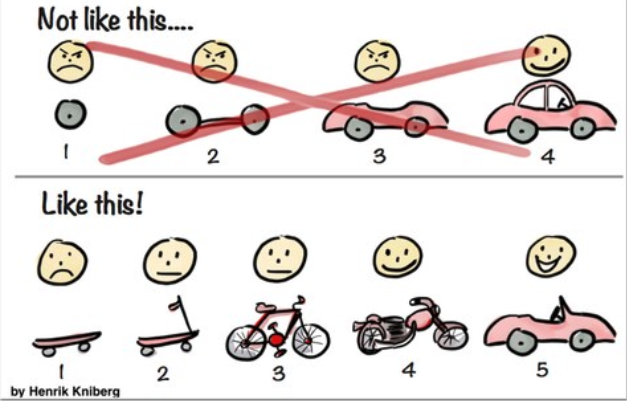

### 1. <u>남현우</u>님의 [8년째 같은 제품을 만들고 있습니다](https://speakerdeck.com/ridi/8nyeonjjae-gateun-jepumeul-mandeulgo-issseubnida)

지저분하더라도 일단 빠르게 만든다. MVP!
> 뤼이드의 pashi팀에서 경험해 봤었던 개발 방식...! 개인적으로 너무 재밌었고, 잘 만들고 있다는 느낌이 들었던 ㅎㅎ

빛순우님께서 1차 목표는 킥보드 버전을 만드는 것이라고 하셨던 기억이 난다.

> 아래는, 글을 보고 잊고 싶지 않았던 내용이다.

####조금 더럽혀도 되는 것💩
- 시각적인 일관성
- 불친절한 UX
- 코드 품질
- 성능 및 안정성

=> 나중에 치우기 쉬운것

####함부로 더럽히면 안되는 것✨
- 문제 영역(Domain)

  너무 넓은 문제를 푸는 것은 아닌지
  
- 재사용성(Composability)

  언젠가 조립될 수 있을까?
  
=> 시간이 지나도 수습이 안되는 것

####가치제안

오래도록 진화하는 제품을 만들자 
프로그램을 짜지 말고 제품도 짜지 말자 
<u>건강한 컴포넌트를 많이 만들고 잘 관리하자</u>

 

----
