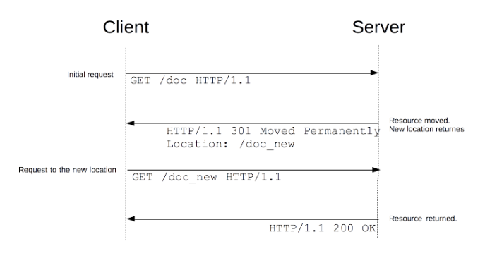

redirect가 뭘까? 심플하게 보면 영어단어 뜻 그대로이다. `Redirect: 다시 향하게 하다, 새 방향으로 돌리다.` web에서의 이러한 redirect 구현 방법은 크게 3가지 정도 있다.

```
1. HTTP 리다이렉트
2. HTML 리다이렉션 `<meta>`
3. javascript 리다이렉션
```

## 1. HTTP 리다이렉트

HTTP 리다이렉트는 `3xx`상태 코드를 지닌 응답이다. 리다이렉트 응답을 수신한 브라우저는, <u>제공된 새로운 URL을 사용하며 그것을 즉시 로드</u>한다.



HTTP 리다이렉트에는 몇 가지 유형이 있으며 세 가지 카테고리로 나누어 진다. `영속적`, `일시적`, `특수` 리다이렉션이 있다.

### 영속적인 리다이렉션

영원히 지속됨을 의미한다. 원래의 URL이 더 이상 사용되지 않아야 하며 새로운 URL을 더 선호해야 함을 시사한다.

> `301` moved permanently
> <br/> `308` permanent redirect

### 일시적인 리다이렉션

표준 위치에서 접근할 수 없고 다른 위치에서 접근 가능한 경우가 있다. 이런 경우 일시적인 리다이렉트가 사용될 수 있다.

> `302` Found
> <br/> `303` See Other
> <br/> `307` Temporary Redirect

### 특수 리다이렉션

`304` Not Modified(수정되지 않음)

- 로컬에 의해 캐시된 복사본으로 페이지를 리다이렉트 시킨다.

`300` (다중 선택) 수동 리다이렉션이 있다.

## 2. HTML 리다이렉션

프론트엔드 개발자는 서버에 대한 제어권을 가지고 있지 않다. 이러한 상황 때문에, 프론트엔드 개발자들은 **refresh**를 설정하기 위해 페이지의 `<head>`내에 `<meta>`엘리먼트와 `http-equiv`속성으로 HTML 페이지를 만들 수 있다. 해당 페이지를 디스플레이할 때, 브라우저는 이 엘리먼트를 발견하고 표시된 페이지로 이동한다.

```html
<head>
  <meta http-equiv="refresh" content="0;URL='https://abelog.netlify.com/'" />
</head>
```

> 이런 리다이렉션들은 브라우저에서 뒤로 가기 버튼을 무용지물로 만든다.

**가능한 경우, 항상 HTTP 리다이렉트를 사용해야 하며, `<meta>`엘리먼트를 사용해서는 안된다.**

## 3. 자바스크립트 리다이렉션

js의 리다이렉션은 `window.location`프로퍼티에 값을 설정해서 만들어지며, 새로운 페이지가 로드된다.

```js
window.location = 'https://abelog.netlify.com/'
```

HTML 리다이렉션처럼, 모든 리소스에서 동작하는 것은 아니며, <u>자바스크립트를 실행한 클라이언트 상에서만 동작</u>한다. <br/>
조건에 따라 리다이렉션 시킬 수 있다는 점에서 유용하다.

## TIP

### 우선 순위

URL 리다이렉션에 대한 세 가지 방법이 있기에, 몇 가지 방법이 동시에 실행될 수 있는데, 어떤 것이 먼저 적용될까? 우선 순위는 다음과 같다.

1. 페이지가 읽힌 적도 없고 전송된 적도 없는 경우, HTTP 리다이렉트가 항상 먼저 실행된다.
2. 어떤 HTTP 리다이렉트도 없는 경우에, HTML 리다이렉트(`<meta>`)가 실행된다.
3. 자바스크립트 리다이렉트는 최후의 수단으로써 사용되며, 클라이언트 측에서 자바스크립트를 활성화 시킨 경우에만 사용할 수 있다.

### Use case

URL 단축, 웹페이지가 이동될 때 발생하는 죽은 링크의 예방, 하나의 웹사이트를 가리키는 동일 소유자의 여러 도메인 이름 허용, 웹사이트 안팎으로의 탐색 안내, 개인 정보 보호 등이 있다.

### 출처

https://developer.mozilla.org/ko/docs/Web/HTTP/Redirections
https://ko.wikipedia.org/wiki/URL_%EB%A6%AC%EB%8B%A4%EC%9D%B4%EB%A0%89%EC%85%98

#### 관련해서 읽으면 좋은 글

Redirect vs Forward: https://doublesprogramming.tistory.com/63
