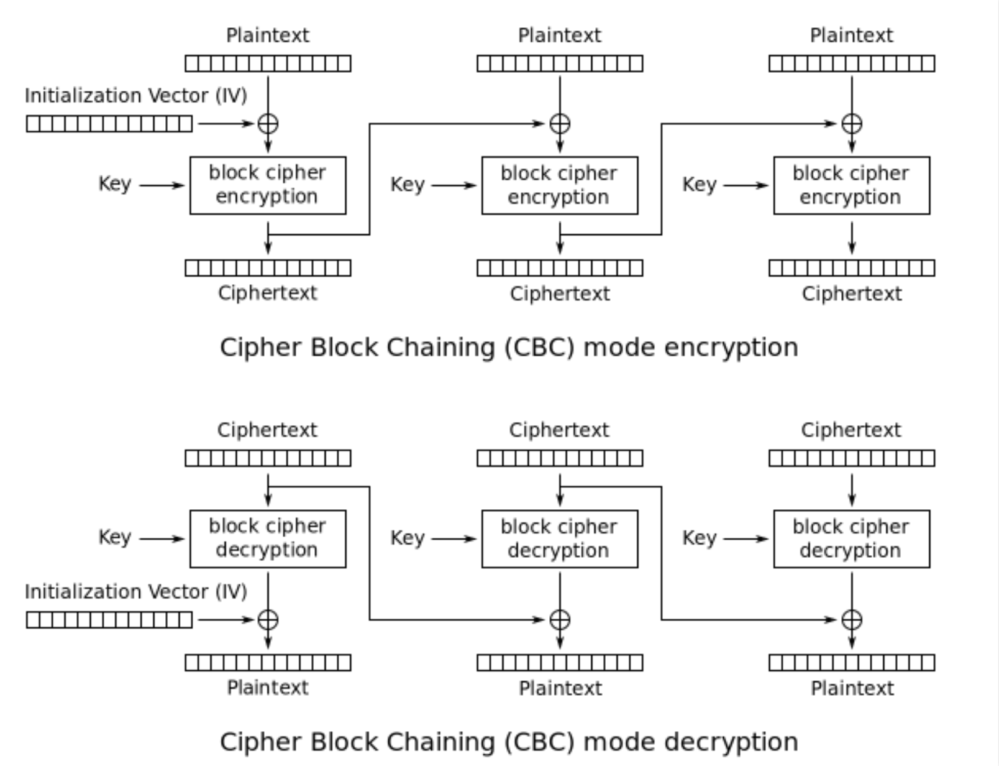

## Prologue

대개 금융사와 연동할 때는 통신시에 암호화를 한다. 암호에는 여러 방법이 있지만 필드에서 가장 보편적으로 쓰이고 있는 AES 대칭키 알고리즘에 대해 이야기 하고, Golang으로 구현한 내용을 공유한다.

## **AES(Advanced Encryption Standard) 알고리즘이란?**

말 그대로, `고급 암호화 표준`이다. 2001년에 미국 표준 기술 연구소에서 AES 공모전을 열었고 Rijndael(레인달) 알고리즘이 채택 되었다. AES는 암호화와 복호화 과정에서 동일한 키를 사용하는 대칭 키 알고리즘이다.

암호키의 길이는 AES-128, AES-192, AES-256이 있는데 각각 16, 24, 32글자(byte)로 작성할 수 있다.

## CBC(Cipher Block Chaining) Mode

실무에서는 데이터의 크기가 크기 때문에 16byte씩 잘라서 암호화 한다. CBC는 블록 암호화 운영 모드 중 보안성이 제일 높은 암호화 방법이고 가장 많이 사용된다.

평문의 각 블록은 XOR연산을 통해 이전 암호문과 연산되고 첫번째 암호문에 대해서는 IV(Initial Vector)가 암호문 대신 사용된다. 이 때 IV는 제 2의 키가 될 수 있다.

암호문이 블록의 배수가 되기 때문에 복호화 후 평문을 얻기 위해서 Padding을 해야만 한다.

암호화가 병렬처리가 아닌 순차적으로 수행되어야 한다.



## Golang으로 AES-256 CBC모드 구현하기

go에서는 관련된 함수들을 crypto 패키지에서 제공한다.

`func NewCipher(key []byte) (cipher.Block, error)` : 대칭키 암호화 블록 생성

```go
func NewCipher(key []byte) (cipher.Block, error) {
		k := len(key)
		switch k {
		default:
				return nil, KeySizeError(k)
		case 16, 24, 32:
				break
		}
		return newCipher(key)
}
```

`func NewCBCEncrypter(b Block, iv []byte) BlockMode` : 암호화 블록과 IV로 암호화 블록 모드 인스턴스 생성

`func (x *cbcEncrypter) CryptBlocks(dst, src []byte)` : 암호화 블록 모드 인스턴스로 암호화

`func NewCBCDecrypter(b Block, iv []byte) BlockMode` : 암호화 블록과 IV로 복호화 블록 모드 인스턴스 생성

`func (x *cbcDecrypter) CryptBlocks(dst, src []byte)` : 복호화 블록 모드 인스턴스로 복호화

블록 암호화는 암호화할 데이터의 길이가 블록크기(aes.BlockSize == 16)의 배수 이어야 한다. 블록 크기에서 모자라는 padding으로 채워 줘야 한다.

### encryptor, decryptor 구현

```go
package cipher

import (
	"bytes"
	"crypto/aes"
	"crypto/cipher"
	"encoding/base64"
	"strings"
)

type Crypto interface {
	Encrypt(plainText string) (string, error)
	Decrypt(cipherIvKey string) (string, error)
}

type niceCrypto struct {
	cipherKey  string
	cipherIvKey string
}

func (c niceCrypto) Encrypt(plainText string) (string, error) {
	if strings.TrimSpace(plainText) == "" {
		return plainText, nil
	}

	block, err := aes.NewCipher([]byte(c.cipherKey))
	if err != nil {
		return "", err
	}

	encrypter := cipher.NewCBCEncrypter(block, []byte(c.cipherIvKey))
	paddedPlainText := padPKCS7([]byte(plainText), encrypter.BlockSize())

	cipherText := make([]byte, len(paddedPlainText))
	// CryptBlocks 함수에 데이터(paddedPlainText)와 암호화 될 데이터를 저장할 슬라이스(cipherText)를 넣으면 암호화가 된다.
	encrypter.CryptBlocks(cipherText, paddedPlainText)

	return base64.StdEncoding.EncodeToString(cipherText), nil
}

func (c niceCrypto) Decrypt(cipherText string) (string, error) {
	if strings.TrimSpace(cipherText) == "" {
		return cipherText, nil
	}

	decodedCipherText, err := base64.StdEncoding.DecodeString(cipherText)
	if err != nil {
		return "", err
	}

	block, err := aes.NewCipher([]byte(c.cipherKey))
	if err != nil {
		return "", err
	}

	decrypter := cipher.NewCBCDecrypter(block, []byte(c.cipherIvKey))
	plainText := make([]byte, len(decodedCipherText))

	decrypter.CryptBlocks(plainText, decodedCipherText)
	trimmedPlainText := trimPKCS5(plainText)

	return string(trimmedPlainText), nil
}

func NewNiceCrypto(cipherKey, cipherIvKey) (Crypto, error) {
	if ck := len(cipherKey); ck != 32 {
		return nil, aes.KeySizeError(ck)
	}

	if cik := len(cipherIvKey); cik != 16 {
		return nil, aes.KeySizeError(cik)
	}

	return &niceCrypto{cipherKey, cipherIvKey}
}

func padPKCS7(plainText []byte, blockSize int) []byte {
	padding := blockSize - len(plainText)%blockSize
	padText := bytes.Repeat([]byte{byte(padding)}, padding)
	return append(plainText, padText...)
}

func trimPKCS5(text []byte) []byte {
	padding := text[len(text)-1]
	return text[:len(text)-int(padding)]
}
```

### 테스트 코드

```go
package cipher

import (
	"testing"

	"github.com/stretchr/testify/assert"
)

func TestEncrypt(t *testing.T) {
	t.Run("valid key size", func(t *testing.T) {
		cipherKey := "CIPHERKEY01234567890123456789012"
		cipherIvKey := "CIPHERIVKEY01234"
		
		c, err := NewNiceCrypto(cipherKey, cipherIvKey)

		assert.NoError(t, err)
		assert.Equal(t, &niceCrypto{cipherKey, cipherIvKey}, c)
	})

	t.Run("invalid key size", func(t *testing.T) {
		cipherKey := "CIPHERKEY01234567"
		cipherIvKey := "CIPHERIVKEY"

		_, err := NewNiceCrypto(cipherKey, cipherIvKey)

		assert.Error(err)
	})

	t.Run("plain test `Abel Ko` should be equal `HD4PbbIOrV10Qc/+/7e+IA==`", func(t *testing.T) {
		cipherKey := "CIPHERKEY01234567890123456789012"
		cipherIvKey := "CIPHERIVKEY01234"
		plainText := "Abel Ko"
		expected := "HD4PbbIOrV10Qc/+/7e+IA=="

		c, err := NewNiceCrypto(cipherKey, cipherIvKey)
		assert.NoError(t, err)

		cipher, err := c.Encrypt(plainText)
		assert.NoError(t, err)
		assert.EqualValues(t, expected, cipher)
	})
}

func TestDecrypt(t *testing.T) {
	t.Run("decrypted text `bgyE7m4EeLqQvtKnihJMfg==` should be equal `Abel Ko`", func(t *testing.T) {
		cipherKey := "CIPHERKEY01234567890123456789012"
		cipherIvKey := "CIPHERIVKEY01234"
		chiperText := "HD4PbbIOrV10Qc/+/7e+IA=="
		expected := "Abel Ko"

		c, err := NewNiceCrypto(cipherKey, cipherIvKey)
		assert.NoError(t, err)

		actual, err := c.Decrypt(chiperText)
		assert.NoError(t, err)
		assert.EqualValues(t, expected, actual)
	})
}
```

### 참고한 자료

- [https://en.wikipedia.org/wiki/Block_cipher_mode_of_operation](https://en.wikipedia.org/wiki/Block_cipher_mode_of_operation)
- [https://golang.org/pkg/crypto/aes/](https://golang.org/pkg/crypto/aes/)
- [https://golang.org/pkg/crypto/cipher/](https://golang.org/pkg/crypto/cipher/)
- [https://ko.wikipedia.org/wiki/고급*암호화*표준](https://ko.wikipedia.org/wiki/%EA%B3%A0%EA%B8%89_%EC%95%94%ED%98%B8%ED%99%94_%ED%91%9C%EC%A4%80)
